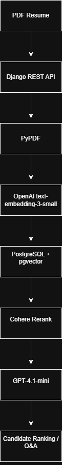
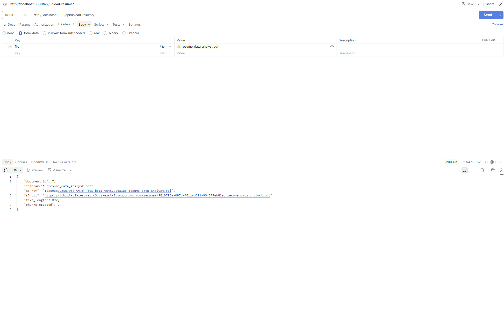
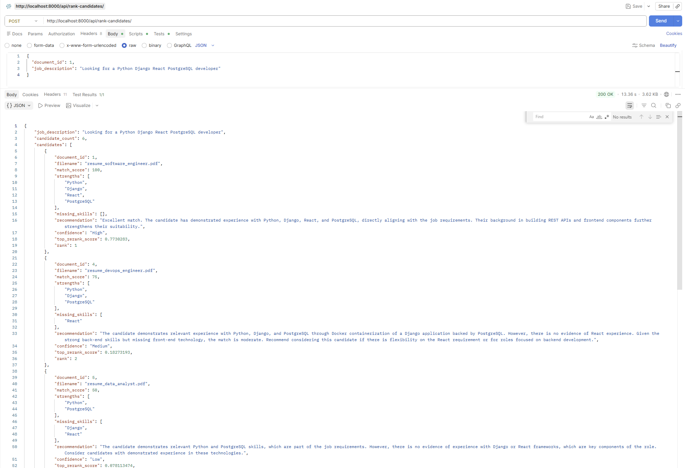
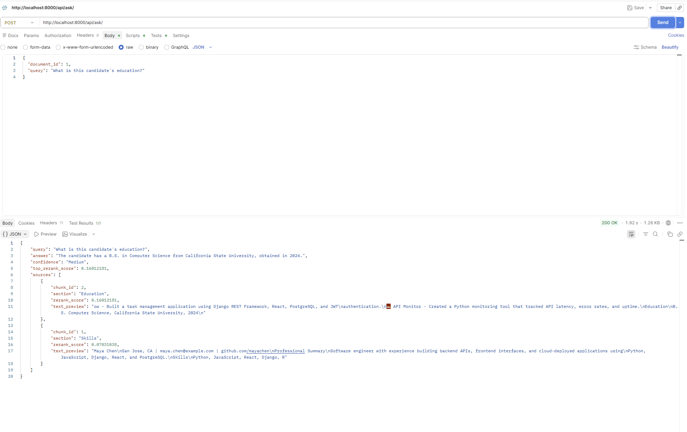

# AI Resume Search & Candidate Ranking System

An AI-powered recruiting platform that uses Retrieval-Augmented Generation (RAG), vector search, OpenAI embeddings, and Cohere reranking to evaluate resumes against job descriptions and rank candidates based on skill alignment.

## Highlights

- Built a Retrieval-Augmented Generation (RAG) recruiting platform using Django, PostgreSQL, pgvector, OpenAI Embeddings, and Cohere Rerank.
- Implemented semantic resume search, candidate Q&A, job matching, and multi-candidate ranking.
- Designed a deterministic scoring system to improve ranking consistency and reduce LLM scoring variability.
- Dockerized the full application stack and integrated AWS S3 for document storage.

## Features
- Upload PDF resumes
- Semantic search using embeddings
- RAG question answering
- Job-to-candidate matching
- Multi-candidate ranking
- AWS S3 document storage
- Docker deployment

## Tech Stack

**Backend:** Python, Django REST Framework

**Database:** PostgreSQL, pgvector

**AI/LLM:** OpenAI Embeddings, Cohere Rerank, RAG

**Cloud:** AWS S3

**Infrastructure:** Docker

## Architecture



## API Endpoints

```text
POST /api/upload-resume/
POST /api/search-resume/
POST /api/ask/
POST /api/match-job/
POST /api/rank-candidates/
```

## Environment Variables

Create `backend/.env` using `backend/.env.example` and provide:

```env
OPENAI_API_KEY=
COHERE_API_KEY=
AWS_ACCESS_KEY_ID=
AWS_SECRET_ACCESS_KEY=
AWS_STORAGE_BUCKET_NAME=
AWS_S3_REGION_NAME=
```

## Running Locally

1. Clone the repository

```bash
git clone https://github.com/nx62595/jobfit-ai.git
cd jobfit-ai
```

2. Create environment variables

```bash
cp backend/.env.example backend/.env
```

3. Start services

```bash
docker compose up --build
```

4. API available at

```text
http://localhost:8000
```

## Resume Upload



## Candidate Ranking



## Candidate Q&A



## Evaluation

Evaluated retrieval and answer quality using RAGAS:

- Context Precision: 1.00
- Context Recall: 1.00
- Faithfulness: 0.97
